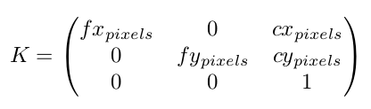

# Monocular camera calibration

### Description

Camera calibration is the process of computing a camera’s internal properties such as focal length, lens distortion coefficients, etc. These properties are intrinsic to the camera, which once estimated, do not change. However, different calibration software (or different trials) might produce slightly different results; these slight variations are due to noise in the imaging system.

In computer/robotics vision, it is always advisable to work with calibrated cameras as it is a one-shot process and it makes things much easier there on-wards. For e.g., consider the case of estimating the rotation (R) and translation (t) between two monocular camera positions. If we do not know K, we will have to estimate F (fundamental matrix) using the point correspondences and it is not easy  to decompose F into R and t because F is composed of K, R, and t. On the other hand if you knew K, we can estimate E (essential matrix) and decompose it into R and t as E is only composed of R and t.

In this code K matrix is calculated using the widely used Zhang’s method(Zhang. Z, ”A flexible new technique for camera calibration”, PAMI, 2000 ). This method relies on planar checker-board to easily establish 3D-2D correspondences and then solves for the planar homographies to factor out the K matrix.

The estimated K matrix will be of the form shown below:

The subscript pixels means that the estimated quantities are in units of pixels and not in meters (or in any other metric units). For well manufactured (expensive) cameras, fx pixels and fy pixels are generally same. Also, cx pixels and cy pixels are equal to the image center coordinates. But many times we do not use such good cameras and as a result we expect the above statements to be invalid.